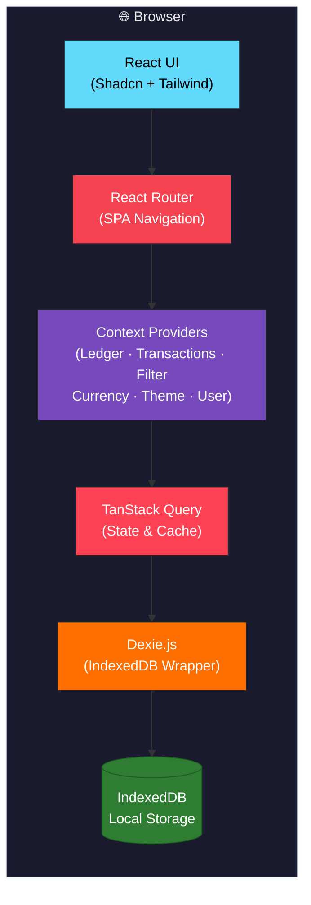
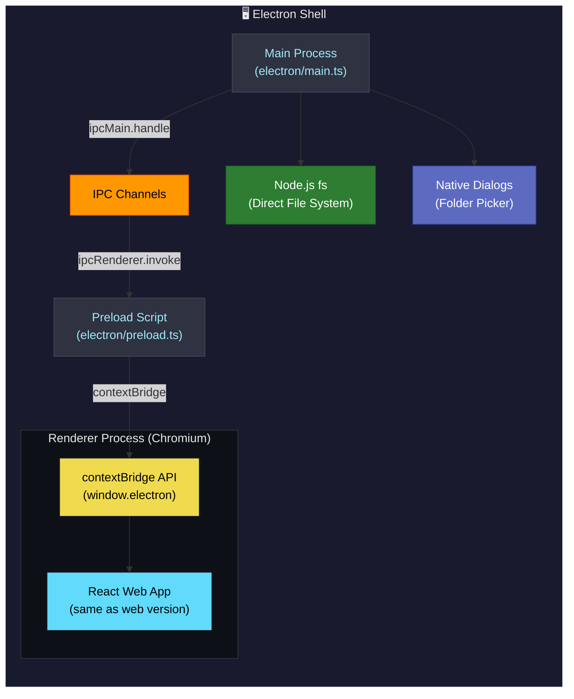
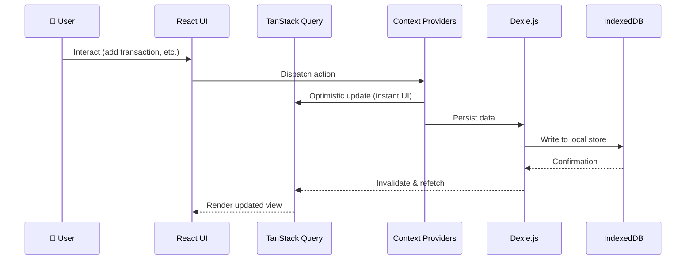

<h1 align="center">💰 Budget It — Personal Finance Tracker</h1>

<p align="center">
  <i>A privacy-focused, local-first personal finance app. Track spending, manage budgets, and gain insights — without sending your data to the cloud.</i>
</p>

<!-- ─── Dynamic Status Badges ─────────────────────────────────── -->
<p align="center">
  <a href="https://app.circleci.com/pipelines/github/nrajesh/budget-it">
    
  </a>
  <a href="https://budget-it-nine.vercel.app/">
    
  </a>
  <a href="https://github.com/nrajesh/budget-it">
    
  </a>
  <a href="https://opensource.org/licenses/MIT">
    
  </a>
</p>

<!-- ─── Tech Stack Badges ─────────────────────────────────────── -->
<p align="center">
  
  
  
  
  
  
</p>

---

## 🌟 Key Features

| Category | Feature |
|----------|---------|
| 🔒 **Privacy** | 100% local — data lives in your browser's IndexedDB. No cloud, no servers. |
| 📚 **Multi-Ledger** | Separate ledgers for Personal, Business, Joint finances. |
| 💳 **Transactions** | Track with categories, sub-categories, vendors, and account groups. |
| 📊 **Budgets** | Monthly, quarterly, yearly, or one-time budgets with progress tracking. |
| 🔁 **Scheduled** | Recurring transactions with smart deduplication on import. |
| 📈 **Analytics** | Visual breakdowns of income, expenses, and savings trends. |
| 🫀 **Financial Pulse** | Premium dashboard for high-level financial health monitoring. |
| 💬 **Smart Search** | Natural language filtering for transactions, categories, and dates. |
| 💾 **Backup & Restore** | Encrypted or plain JSON backups — import instantly without page reloads. |
| ⏰ **Auto-Backup** | Scheduled backups via File System Access API (web) or direct filesystem (Electron). |

---

## 🏗️ System Architecture

### Web Application Architecture



### Electron Desktop Architecture



### Data Flow



---

## 🚀 Getting Started

### Prerequisites

> [!IMPORTANT]
> Before you begin, make sure you have the following installed:

| Requirement | Version | How to Install |
|-------------|---------|----------------|
| **Node.js** | v18+ | [Download](https://nodejs.org/) or use `nvm install 18` |
| **pnpm** | v8+ | `npm install -g pnpm` |
| **Git** | Any | [Download](https://git-scm.com/) |

> [!NOTE]
> **pnpm** is strongly recommended. The project uses `pnpm-lock.yaml`, and all scripts are configured for it.

### Step-by-Step Setup

```bash
# 1. Clone the repository
git clone https://github.com/nrajesh/budget-it.git
cd budget-it

# 2. Install dependencies
pnpm install

# 3. Verify the setup (optional but recommended)
pnpm lint && pnpm build
```

> [!TIP]
> If `pnpm install` fails, try deleting `node_modules` and running `pnpm install` again:
> ```bash
> rm -rf node_modules && pnpm install
> ```

---

### 🌐 Running the Web App

```bash
pnpm dev
```

Open **http://localhost:8081** in your browser or the port defined in vite.config.ts. That's it!

---

### 🖥️ Running the Electron Desktop App

```bash
pnpm run electron:dev
```

This single command does everything:
1. Starts the Vite dev server on port `8081`
2. Waits for the server to be ready (`wait-on`)
3. Compiles Electron main & preload TypeScript
4. Launches the Electron window

> [!WARNING]
> **Do NOT run `pnpm dev` separately before `electron:dev`.**
> The `electron:dev` script already starts Vite internally using `concurrently`. Running them separately will cause a port conflict on `8081`.

> [!NOTE]
> **First-time Electron run** may take longer as it compiles TypeScript files and downloads the Electron binary (~100 MB).

---

### 📱 Mobile Support

| Platform | Supported? | How |
|----------|-----------|-----|
| **macOS** | ✅ | Electron desktop app or browser |
| **Windows** | ✅ | Electron desktop app or browser |
| **Linux** | ✅ | Electron desktop app or browser |
| **iOS / Android** | ⚠️ Web only | Deploy to Vercel/Netlify and open in mobile Safari/Chrome |

> Electron cannot run on mobile devices. For mobile access, host the web version and access it via a mobile browser.

---

### 🔨 Building for Production

| Target | Command | Output |
|--------|---------|--------|
| Web | `pnpm build` | `dist/` |
| Desktop (all platforms) | `pnpm run electron:build` | `release/` (DMG, EXE, AppImage) |

---

## 🔗 Live Demo
Try the latest version of the app here: **[budget-it-nine.vercel.app](https://budget-it-nine.vercel.app)**

---

## 📂 Project Structure

```
budget-it/
├── electron/                  # Electron-specific code
│   ├── main.ts                #   Main process (window, IPC, fs access)
│   └── preload.ts             #   Preload script (contextBridge)
├── src/
│   ├── components/            # Reusable UI components
│   │   ├── ui/                #   Shadcn primitives (Button, Dialog, etc.)
│   │   ├── budgets/           #   Budget management
│   │   ├── charts/            #   Visualizations
│   │   ├── dashboard/         #   Home dashboard widgets
│   │   ├── dialogs/           #   Modals and popups
│   │   ├── filters/           #   Search & filtering logic
│   │   └── transactions/      #   Transaction tables & logic
│   ├── contexts/              # React Context Definitions
│   ├── providers/             # Context Providers (Data, Theme, etc.)
│   ├── hooks/                 # Custom React hooks
│   ├── pages/                 # Route-level page components
│   ├── types/                 # TypeScript type definitions
│   ├── utils/                 # Helper functions (currency, date, etc.)
│   └── tests/                 # Test files
├── .circleci/                 # CircleCI Pipeline config
├── package.json
├── vite.config.ts
└── tsconfig.json
```

---

## ✅ Quality Assurance

We enforce high code quality standards using a strict **CircleCI** pipeline. Every pull request must pass the following checks before merging:

| Check | Command | Description |
|-------|---------|-------------|
| **Linting** | `pnpm lint` | ESLint checks for code quality and best practices. |
| **Type Safe** | `tsc --noEmit` | Full TypeScript strict mode check. |
| **Formatting** | `pnpm format:check` | Prettier verification to ensure consistent style. |
| **Testing** | `pnpm test:coverage` | Vitest unit tests with coverage reporting. |
| **Security** | `pnpm audit` | Checks dependencies for known vulnerabilities. |
| **Build** | `pnpm build` | Verifies that the production bundle compiles correctly. |

> [!TIP]
> You can run `pnpm validate` locally to run TypeScript and ESLint checks in one go.

---

## 📚 Documentation & Workflow

### 1. Interpreting the Documentation Folder

The `documentation/` folder serves as the "Constitution" and "Operating System" for the project.

| File | Purpose |
|------|---------|
| **[`SPEC_DRIVEN_DEVELOPMENT.md`](documentation/SPEC_DRIVEN_DEVELOPMENT.md)** | **The Workflow Guide**. Comprehensive guide on how to build features using the Spec-Driven Development methodology. |
| **[`AGENTS.md`](documentation/AGENTS.md)** | **The Rulebook**. Technical constraints and boundaries for the AI agent (e.g., "Privacy First", "Use Tailwind"). |
| **[`SUPPORT.md`](documentation/SUPPORT.md)** | **Support Policy**. How to get help and file issues. |
| **[`SECURITY.md`](documentation/SECURITY.md)** | **Security Policy**. Reporting vulnerabilities and privacy details. |

### 2. How to Work with Speckit

> **Note**: For a deep dive into the workflow, read the [**Spec-Driven Development Guide**](documentation/SPEC_DRIVEN_DEVELOPMENT.md).

#### Quick Start
1.  **Specify**: `/speckit.specify "Build a new feature"`
2.  **Plan**: `/speckit.plan`
3.  **Task**: `/speckit.tasks`
4.  **Implement**: `/speckit.implement`

---

## 🛠️ Development Guide

### Adding New Components
1. `src/components/ui/` — Generic, reusable UI primitives
2. `src/components/<feature>/` — Feature-specific components
3. `src/components/layout/` — Layout wrappers

**Guidelines:**
- Use **functional components** with TypeScript interfaces
- Style with **Tailwind CSS** utility classes
- Ensure **responsive design** (mobile-first)
- Add JSDoc comments for complex logic

### State Management
- `useTransactions()` — global financial data
- `useState` — UI-only state (dialog open/close)
- `useQuery` — async data fetching with TanStack Query

### Testing
```bash
pnpm test              # Run unit tests (Vitest)
pnpm test:coverage     # Run with coverage report
pnpm lint              # Run ESLint checks
pnpm validate          # TypeScript + ESLint in one shot
```

---

## 📦 Deployment

### Deploy to Vercel (Recommended)
```bash
npm i -g vercel
vercel deploy
```
Since the app is fully client-side, it works on any static host: **Vercel**, **Netlify**, **GitHub Pages**, or **Cloudflare Pages**.

---

## 🛡️ Privacy Note

> This application runs entirely in your browser (or local Electron instance). **No data is ever sent to a server.** Clearing your browser cache or site data will remove your financial data unless you have exported a backup. Always keep backups of your important data.

---

<p align="center">
  Made with ❤️ for your financial freedom
</p>