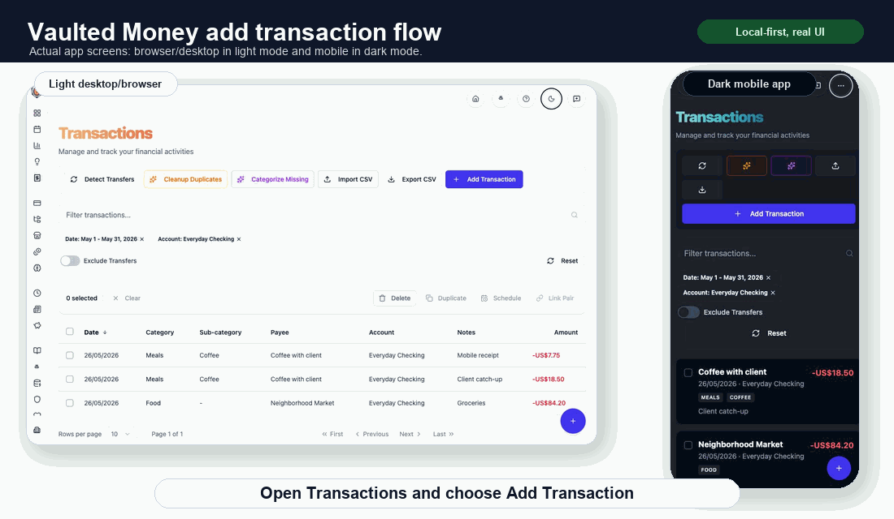

# Vaulted Money

_A private, local-first money tracker for people who want to understand where their money goes without sending their financial life to somebody else's server._



[](https://app.circleci.com/pipelines/github/nrajesh/vaulted.money)
[](https://github.com/nrajesh/vaulted.money)
[](https://opensource.org/licenses/MIT)


## What Is Vaulted Money?

Vaulted Money is a personal finance app you run on your own device. You create a ledger, add or import transactions, group them into accounts and categories, set budgets, and review reports.

The important bit: your data stays local by default. There is no hosted Vaulted Money account, no central database, and no subscription wall around basic budgeting.

## Who Is It For?

- People who want a simple private place to track income, expenses, accounts, and budgets.
- People who are uncomfortable uploading bank exports to a cloud finance service.
- Developers and self-hosters who want an auditable local-first finance app.
- Families, freelancers, or small projects that want separate ledgers for different money contexts.

## What Can It Do?

| Area | Plain-English Meaning |
| --- | --- |
| Ledgers | Keep separate money books, such as Personal, Business, or Joint. |
| Transactions | Record money coming in or going out. |
| Accounts | Track where money lives, such as checking, savings, cash, or credit. |
| Categories | Understand what the money was for. |
| Budgets | Set limits or goals and see progress. |
| Imports | Bring in bank CSV exports. |
| Reports | See income, spending, net worth, trends, and summaries. |
| Backups | Export your data as JSON, with encrypted backup options. |
| Optional AI | Bring your own API key to help categorize transactions. |

## Quick Setup

You need three tools first:

- [Node.js](https://nodejs.org/) 18 or newer
- [pnpm](https://pnpm.io/) 8 or newer
- [Git](https://git-scm.com/)

Then run:

```bash
git clone https://github.com/nrajesh/vaulted.money.git
cd vaulted.money
pnpm install
pnpm dev
```

Open [http://localhost:8081](http://localhost:8081) in your browser.

For the desktop app:

```bash
pnpm run electron:dev
```

That starts the local web app, compiles the Electron files, and opens the desktop window.

## Read Next

The README is intentionally short. Use these pages for the details:

| Page | Best For |
| --- | --- |
| [Getting Started](documentation/GETTING_STARTED.md) | A non-technical first run and first ledger walkthrough. |
| [Setup and Builds](documentation/SETUP.md) | Full web, desktop, Android, iOS, and release commands. |
| [User Guide](documentation/USER_GUIDE.md) | What the app does and how to use the main workflows. |
| [Developer Guide](documentation/DEVELOPER_GUIDE.md) | Project structure, quality checks, AI provider notes, and contribution workflow. |
| [Architecture](documentation/ARCHITECTURE.md) | Technical diagrams and system design. |
| [Why Vaulted Money Exists](documentation/WHY_VAULTED_MONEY.md) | Motivation, privacy stance, and project philosophy. |
| [Support](documentation/SUPPORT.md) | How to get help. |

## Support the Project

Vaulted Money is free and open-source under the MIT license. If you find it useful and want to support development, you have several options:

| Channel | Status |
| --- | --- |
| Buy on Apple App Store (€9.99 one-time) | Coming soon |
| Buy on Google Play Store (€9.99 one-time) | Coming soon |
| Buy desktop binary on Lemon Squeezy or Polar.sh (€9.99 one-time) | Coming soon |
| [GitHub Sponsors](https://github.com/sponsors/nrajesh) | Active |
| PayPal / direct transfer (see in-app Donation page) | Active |

The same app is free to build from source, regardless of which channel you choose. Store purchases exist to make installation simpler for non-technical users and to support continued development.

## Privacy In One Paragraph

Vaulted Money stores financial data in your browser or local app storage. Nothing is sent to a Vaulted Money server because there is no Vaulted Money server. If you enable optional AI categorization, only the data needed for that action is sent to the provider you configure with your own API key. Because the app is local-first, backups are your responsibility.

## License

Vaulted Money is released under the [MIT License](LICENSE).

Made for calmer, more private money tracking.
