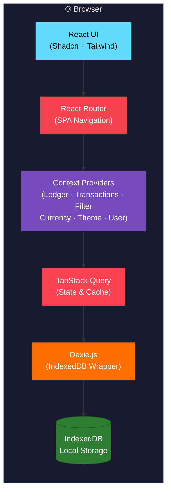
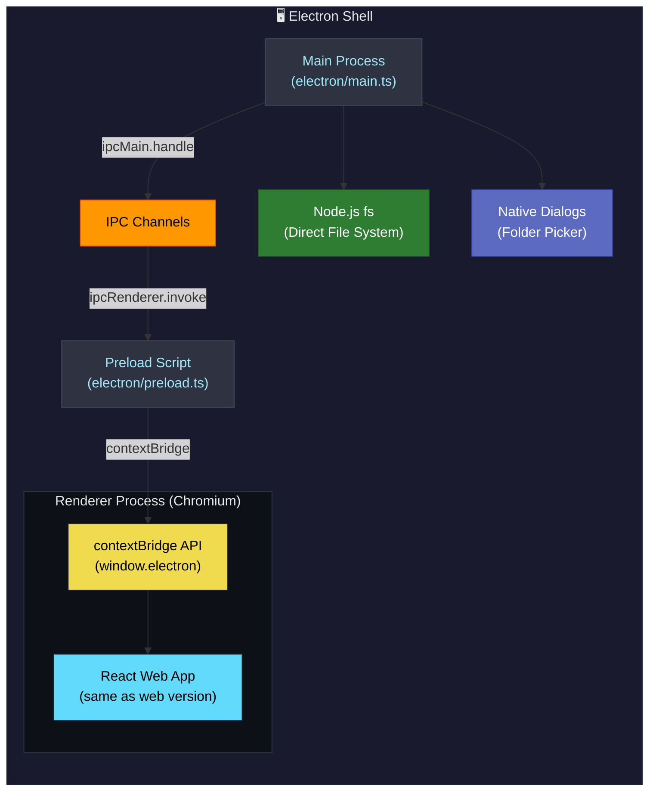
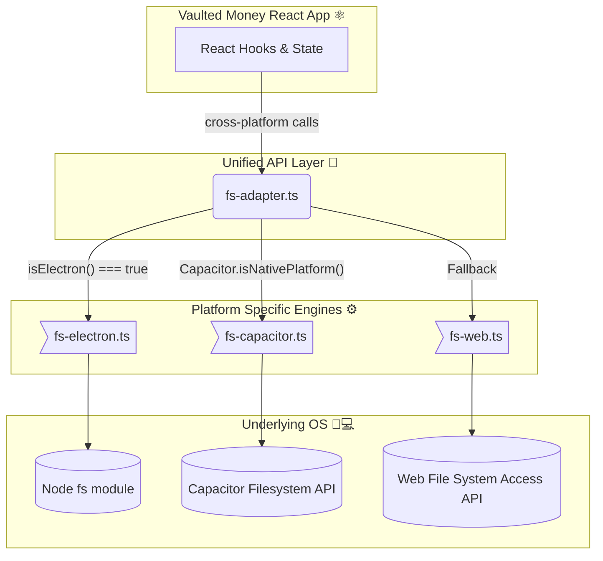
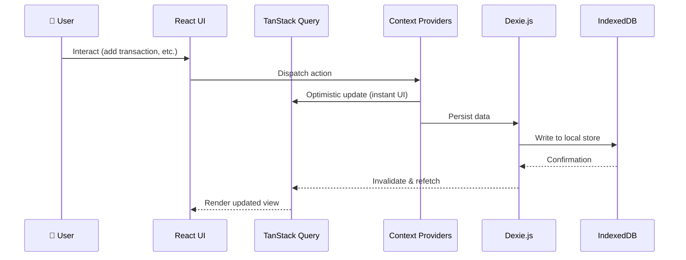
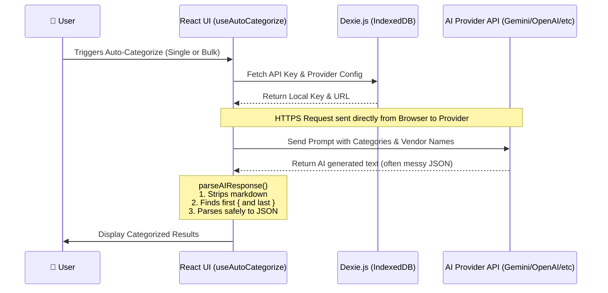

# Architecture

## System Overview

### Routing Overview

The application uses `react-router-dom` with two distinct route trees:

| Route | Component | Auth required? | Purpose |
|---|---|---|---|
| `/` | `HomePage.tsx` | No | Public landing page: trust signals, install commands, backup guidance, links to `/ledgers` |
| `/ledgers` | `LedgersPage.tsx` | No | Ledger selector — entry point for the authenticated app |
| `/ledgers/:id/*` | `Layout` (nested) | Yes (active ledger) | All authenticated modules: dashboard, transactions, budgets, reports, settings |

`HomePage.tsx` lives outside the authenticated `Layout` route so it never triggers the active-ledger redirect. It retains the language switcher and light/dark toggle but has its own header rather than the app sidebar.

---

### Web Application Architecture

```mermaid
graph TB
    subgraph Browser["🌐 Browser"]
        direction TB
        UI["React UI<br/>(Shadcn + Tailwind)"]
        Router["React Router<br/>(SPA Navigation)"]
        State["TanStack Query<br/>(State & Cache)"]
        Contexts["Context Providers<br/>(Ledger · Transactions · Filter<br/>Currency · Theme · User)"]
        DB["Dexie.js<br/>(IndexedDB Wrapper)"]
        IDB[("IndexedDB<br/>Local Storage")]
    end

    UI --> Router
    Router --> Contexts
    Contexts --> State
    State --> DB
    DB --> IDB

    style Browser fill:#1a1a2e,stroke:#16213e,color:#e8e8e8
    style UI fill:#61DAFB,stroke:#20232A,color:#000
    style Router fill:#f44250,stroke:#20232A,color:#fff
    style State fill:#ff4154,stroke:#20232A,color:#fff
    style Contexts fill:#764abc,stroke:#20232A,color:#fff
    style DB fill:#ff6f00,stroke:#20232A,color:#fff
    style IDB fill:#2e7d32,stroke:#1b5e20,color:#fff
```

### Electron Desktop Architecture

```mermaid
graph TB
    subgraph Electron["🖥️ Electron Shell"]
        direction TB
        Main["Main Process<br/>(electron/main.ts)"]
        Preload["Preload Script<br/>(electron/preload.ts)"]

        subgraph Renderer["Renderer Process (Chromium)"]
            direction TB
            WebApp["React Web App<br/>(same as web version)"]
            Bridge["contextBridge API<br/>(window.electron)"]
        end

        IPC["IPC Channels"]
        FS["Node.js fs<br/>(Direct File System)"]
        Dialog["Native Dialogs<br/>(Folder Picker)"]
    end

    Main -->|"ipcMain.handle"| IPC
    IPC -->|"ipcRenderer.invoke"| Preload
    Preload -->|"contextBridge"| Bridge
    Bridge --> WebApp

    Main --> FS
    Main --> Dialog

    style Electron fill:#1a1a2e,stroke:#16213e,color:#e8e8e8
    style Main fill:#2f3241,stroke:#47475c,color:#9feaf9
    style Preload fill:#2f3241,stroke:#47475c,color:#9feaf9
    style Renderer fill:#0d1117,stroke:#30363d,color:#e8e8e8
    style WebApp fill:#61DAFB,stroke:#20232A,color:#000
    style Bridge fill:#f0db4f,stroke:#20232A,color:#000
    style IPC fill:#ff9800,stroke:#e65100,color:#000
    style FS fill:#2e7d32,stroke:#1b5e20,color:#fff
    style Dialog fill:#5c6bc0,stroke:#3949ab,color:#fff
```

### File System Abstraction (Web, Electron, Capacitor Support)

```mermaid
flowchart TD
    subgraph Core["Vaulted Money React App ⚛️"]
        A[React Hooks & State]
    end

    subgraph Adapter["Unified API Layer 🌉"]
        B(fs-adapter.ts)
    end

    subgraph Implementations["Platform Specific Engines ⚙️"]
        C>fs-electron.ts]
        D>fs-capacitor.ts]
        E>fs-web.ts]
    end

    subgraph Native["Underlying OS 📱💻"]
        F[(Node fs module)]
        G[(Capacitor Filesystem API)]
        H[(Web File System Access API)]
    end

    A -->|"cross-platform calls"| B

    B -->|"isElectron() === true"| C
    B -->|"Capacitor.isNativePlatform()"| D
    B -->|"Fallback"| E

    C --> F
    D --> G
    E --> H
```

### Data Flow

```mermaid
sequenceDiagram
    participant U as 👤 User
    participant UI as React UI
    participant TQ as TanStack Query
    participant Ctx as Context Providers
    participant Dex as Dexie.js
    participant IDB as IndexedDB

    U->>UI: Interact (add transaction, etc.)
    UI->>Ctx: Dispatch action
    Ctx->>TQ: Optimistic update (instant UI)
    Ctx->>Dex: Persist data
    Dex->>IDB: Write to local store
    IDB-->>Dex: Confirmation
    Dex-->>TQ: Invalidate & refetch
    TQ-->>UI: Render updated view
```

### AI Auto-Categorization Flow (BYOK)

```mermaid
sequenceDiagram
    participant U as 👤 User
    participant UI as React UI (useAutoCategorize)
    participant Dex as Dexie.js (IndexedDB)
    participant API as AI Provider API (Gemini/OpenAI/etc)

    U->>UI: Triggers Auto-Categorize (Single or Bulk)
    UI->>Dex: Fetch API Key & Provider Config
    Dex-->>UI: Return Local Key & URL
    Note over UI,API: HTTPS Request sent directly from Browser to Provider
    UI->>API: Send Prompt with Categories & Vendor Names
    API-->>UI: Return AI generated text (often messy JSON)
    
    Note over UI: parseAIResponse()<br/>1. Strips markdown<br/>2. Finds first { and last }<br/>3. Parses safely to JSON
    
    UI->>U: Display Categorized Results
```

## Architectural Decisions
- [2024-03-XX] [Direct Browser-to-AI Provider Communication]
    - **Context**: We want users to be able to use AI features without creating a centralized backend that could store their API keys or financial data, maintaining the "local-first" privacy ethos.
    - **Decision**: Implemented BYOK (Bring Your Own Key) where the React app communicates directly with AI provider APIs (Gemini, Anthropic, Mistral, etc.).
    - **Consequences**:
        - **Pros**: Complete privacy for the user. No backend infrastructure required. Zero server costs.
        - **Cons**: Susceptible to CORS issues with certain providers if they don't allow browser requests, requiring users to sometimes handle configuration quirks.
- [2024-03-XX] [Robust client-side JSON parsing for AI outputs]
    - **Context**: Different AI models have wildly varying tendencies to wrap requested JSON in markdown or add conversational fluff ("Sure, here is your JSON:").
    - **Decision**: Added a central `parseAIResponse` utility that manually extracts substrings between `{` and `}` if standard `JSON.parse` fails.
    - **Consequences**: Reduces the rate of categorization failures significantly across different LLM providers without needing complex prompt engineering for every single model type.
- [Date] [Decision Title]
    - **Context**: [Why was this decision made?]
    - **Decision**: [What was decided?]
    - **Consequences**: [What are the pros/cons?]
