# Architecture

## System Overview

### Web Application Architecture

```mermaid
graph TB
    subgraph Browser["🌐 Browser"]
        direction TB
        UI["React UI<br/>(Shadcn + Tailwind)"]
        Router["React Router<br/>(SPA Navigation)"]
        State["TanStack Query<br/>(State & Cache)"]
        Contexts["Context Providers<br/>(Ledger · Transactions · Filter<br/>Currency · Theme · User)"]
        DB["Dexie.js<br/>(IndexedDB Wrapper)"]
        IDB[("IndexedDB<br/>Local Storage")]
    end

    UI --> Router
    Router --> Contexts
    Contexts --> State
    State --> DB
    DB --> IDB

    style Browser fill:#1a1a2e,stroke:#16213e,color:#e8e8e8
    style UI fill:#61DAFB,stroke:#20232A,color:#000
    style Router fill:#f44250,stroke:#20232A,color:#fff
    style State fill:#ff4154,stroke:#20232A,color:#fff
    style Contexts fill:#764abc,stroke:#20232A,color:#fff
    style DB fill:#ff6f00,stroke:#20232A,color:#fff
    style IDB fill:#2e7d32,stroke:#1b5e20,color:#fff
```

### Electron Desktop Architecture

### Data Flow

## Architectural Decisions
- [Date] [Decision Title]
    - **Context**: [Why was this decision made?]
    - **Decision**: [What was decided?]
    - **Consequences**: [What are the pros/cons?]
