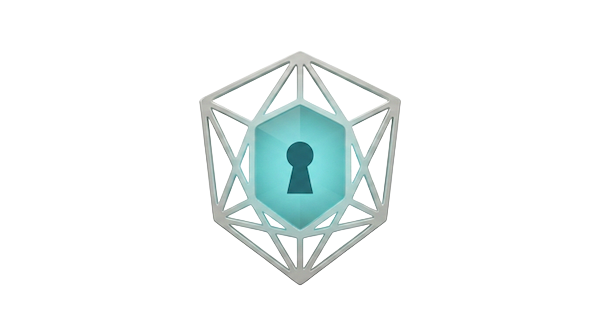
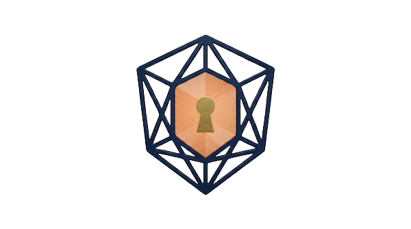

# Vaulted Money Brand Identity Manual

## 1. Brand Philosophy and Symbolism

The Vaulted Money brand identity is an architectural synthesis of structural absolute and fluid accessibility. The name **"Vaulted"** transcends mere storage; it evokes an environment of fortified value, where capital is protected by the most efficient geometry known to nature.

By utilizing the **hexagon**—the foundation of the honeycomb and the most resilient shape for load-bearing structures—the brand signals a commitment to optimized, reinforced security.

*   **Hexagonal Wireframe**: An isometric projection that represents the underlying architecture of global finance. The technical precision of the structural struts mirrors the immutable transparency of digital ledgers and blockchain technology.
*   **Central Keyhole**: Represents the gateway to exclusivity. It is the defining mark of managed access, signifying that while assets are held within a high-security environment, they remain immediately available to those with the requisite credentials.

---

## 2. Visual Core: The Shield and Keyhole Logo

The Vaulted Money logo is a masterwork of geometric precision, composed as a multi-layered hexagonal shield. It is an **isometric projection** of a three-dimensional hexagonal structure.

### Logo Variants

| Dark Mode (High-Tech) | Light Mode (Institutional) |
| :---: | :---: |
|  |  |
| *Silver / Cyan / Negative Space* | *Navy / Gold / Metallic Asset* |

---

## 3. Color Strategy: Dark Environment (High-Tech)

The **"Dark Icon"** variant is the primary asset for high-tech environments. This configuration must be used for all digital assets and interfaces operating in Dark Mode.

### Technical Specifications (HSL)

| Token | HSL Value | Usage |
| :--- | :--- | :--- |
| `--brand-title-from` | `183 51% 74%` | Gradient start (Cyan) |
| `--brand-title-via` | `187 55% 61%` | Gradient mid (Teal) |
| `--brand-title-to` | `199 54% 42%` | Gradient end (Deep Teal) |
| `--brand-accent` | `188 57% 59%` | Primary UI Accents |
| `--brand-accent-soft` | `184 47% 74%` | Hover / Backgrounds |

*   **Visual Tone**: Luminescent, futuristic, and technically precise.
*   **Keyhole**: Negative space allowing the dark background to show through.

---

## 4. Color Strategy: Light Environment (Institutional)

The **"Light Icon"** variant is the institutional standard. This configuration is reserved for professional documentation and light-themed interfaces.

### Technical Specifications (HSL)

| Token | HSL Value | Usage |
| :--- | :--- | :--- |
| `--brand-title-from` | `32 83% 72%` | Gradient start (Orange-Gold) |
| `--brand-title-via` | `27 72% 67%` | Gradient mid (Amber) |
| `--brand-title-to` | `20 73% 61%` | Gradient end (Rust-Gold) |
| `--brand-accent` | `24 74% 58%` | Primary UI Accents |
| `--brand-accent-strong` | `18 74% 52%` | Alerts / Emphasized UI |

*   **Visual Tone**: Grounded, authoritative, and wealthy.
*   **Keyhole**: Solid metallic gold fill, reinforcing the metaphor of physical security.

---

## 5. Comparative Usage and Contrast Guidelines

Adherence to these rules is mandatory to maintain brand integrity:

*   **Rule 1**: The **Silver/Cyan** variant is reserved exclusively for dark backgrounds.
*   **Rule 2**: The **Navy/Orange** variant is the standard for whitepapers, print, and light-themed interfaces.
*   **Prohibition**: Never use the Silver/Cyan variant on a light background. The Cyan core requires a dark environment for its "glow" effect.

---

## 6. Visual Integrity and Spacing

### Minimum Exclusion Zone
A mandatory margin of **25% of the total height** of the shield must be maintained around the logo.

### Minimum Size
*   **Digital**: 32px height.
*   **Print**: 0.375 inches (9.5mm) height.

### Prohibited Actions
*   ❌ Distorting the wireframe aspect ratio.
*   ❌ Altering the gradient direction or chromatic range.
*   ❌ Swapping core colors between variants.
*   ❌ Adding drop shadows, outer glows, or beveling to the wireframe struts.

---

## 7. Product Narrative

Vaulted Money transforms financial anxiety into clarity through structural discipline and local-first privacy.

*Figure 1: The journey from anxiety to financial control.*
