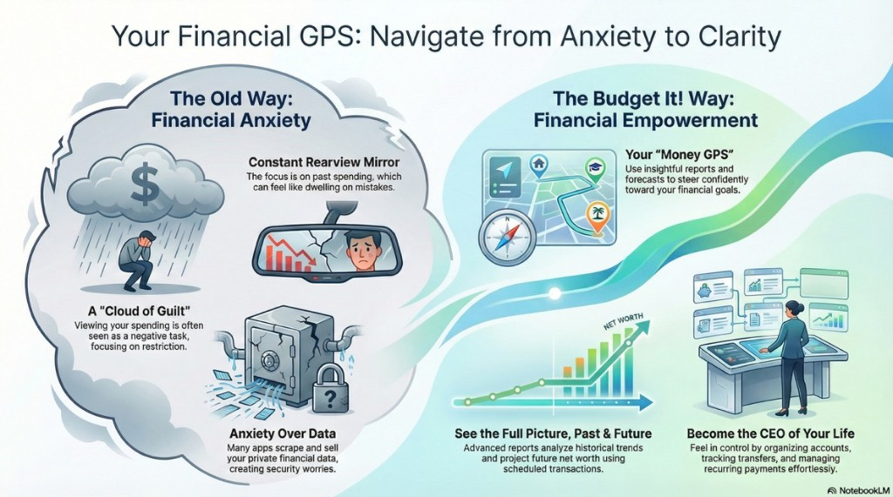
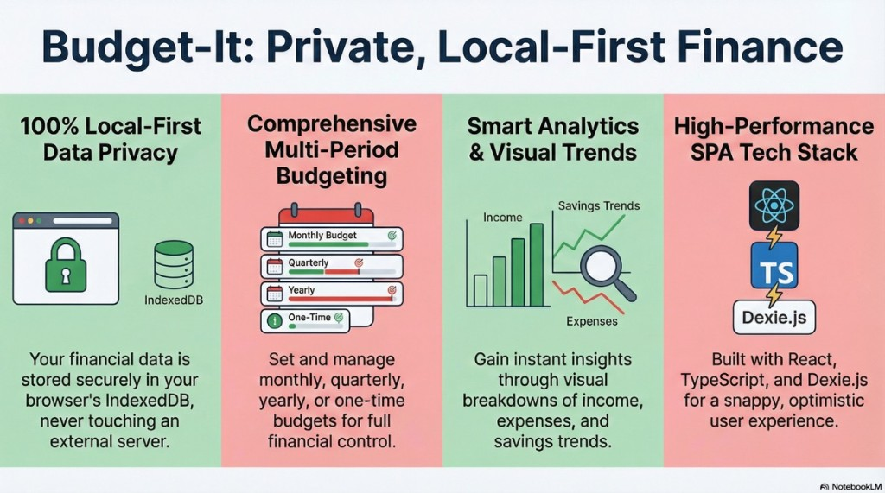

# Why Vaulted Money exists

Basic money clarity - knowing what you earn, what you spend, and what is left - should not be a luxury product. Too many tools put everyday budgeting and peace of mind behind subscriptions and in-app purchases, even though the underlying idea is straightforward: **addition, subtraction, and honest record-keeping**. That gap between simple math and expensive paywalls is what motivated this project.

**Vaulted Money** is built to stay **private and local-first**: your data stays on your device (IndexedDB), without the surveillance and resale patterns that make people anxious about “finance apps” in the first place. As the developer, my hope is threefold: that people can use this app comfortably for years, that communities can **fork and localize** it for their own languages and norms, and that the codebase stays approachable enough for others to adapt rather than reinvent the wheel.

The visuals below are from an earlier design pass; they still describe the product story. The stack panel mentions React, TypeScript, and Dexie - the web client still builds on those; see the main [README](../README.md) for the full picture (Vite, Electron, Capacitor, optional AI, and more).

  

<i>Your Financial GPS: from anxiety and restriction toward clarity, goals, and control.</i>

  

<i>Private, local-first budgeting with multi-period budgets, analytics, and a fast SPA stack.</i>

